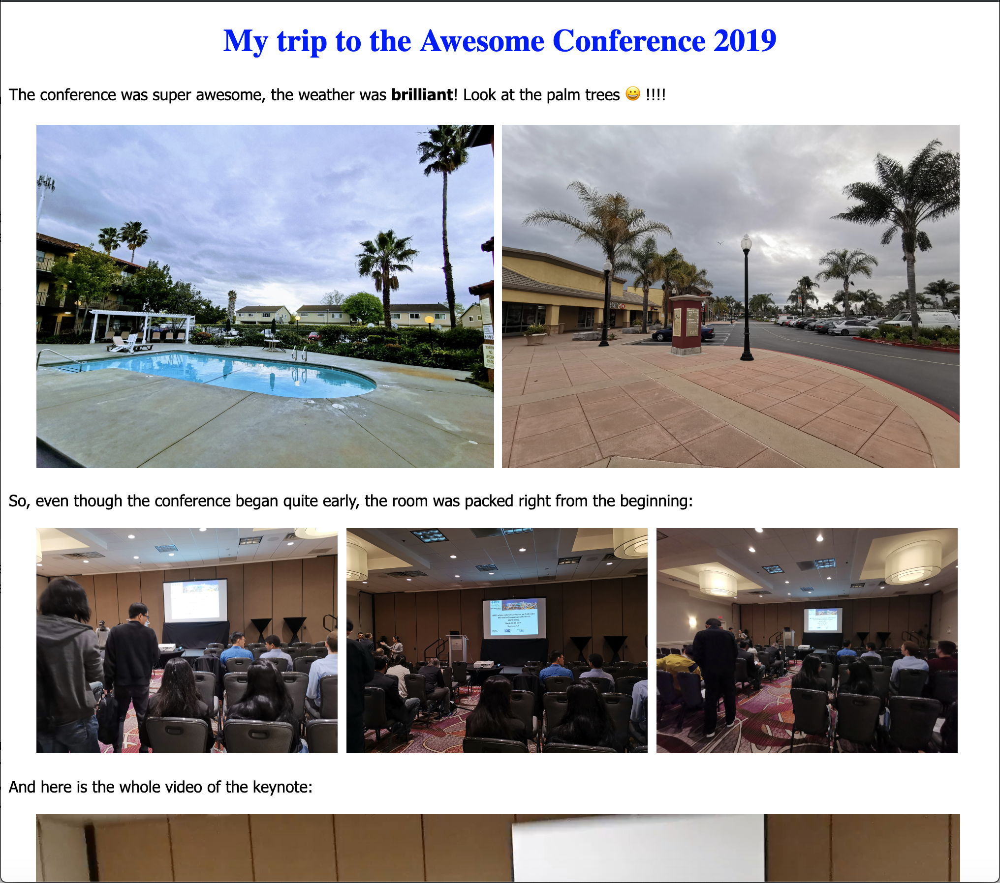

# The Albummer - HTML Multimedia Albums made easy

This is a command line based, super easy tool to create simple but nice photo/
video/audio albums, with Markdown formatted text in between rows of media. It is 
written in the Go language (based on the initial Python implementation), and
binaries - no setup, no dependencies - are supported (coming soon).

- You've gone through all the trouble and organized your prescious photos and
videos into an Album on Google Photos or in a folder on your phone - and now
want to share them? 
- You want to lay out your media in your choice of columns?
- You want to add headings and formatted text?
- You want to share your creation as a single HTML file, with all images and
  videos embedded?
- You want this all to be super-easy?

# 3 steps

1. Create an album text file via the `make-template` command
2. Edit the generated album file
3. Generate HTML from the album file





# By example

## Create an album text file via make-template
Just make sure you have a single folder that contains all the photos and videos
you want to share. For example, download and unzip an album from Google Photos,
or just copy a folder from your mobile phone. In this example, we use the 
folder `Conference2019`:

```bash
$ ls Conference2019
IMG_20190330_094500.jpg   
IMG_20190330_094501.jpg   
IMG_20190330_094502.jpg 
IMG_20190330_094503.jpg   
IMG_20190330_094504.jpg   
IMG_20190330_094506.jpg
IMG_20190330_094507.jpg
IMG_20190330_094508.jpg
IMG_20190330_094509.jpg
VID_20190330_094505.mp4
```

As you can see, it contains 10 files: 9 photos and 1 video.

In our example, the media files are named by their time-stamps. So at 09:45:05, right in the middle of our album, the video was taken.

To convert this folder into an album file for editing, we just run:

```bash
albummer make-template Conference2019 conference.alb       # [enter]
Generated conference.alb
```

This generated the following text file, called `conference.alb`:

```bash
:folder Conference2019
:show_filenames
:use /Users/renerocksai/tools/albummer/default.css

# Conference2019

IMG_20190330_094500.jpg   IMG_20190330_094501.jpg   IMG_20190330_094502.jpg 
IMG_20190330_094503.jpg   IMG_20190330_094504.jpg 

VID_20190330_094505.mp4 

IMG_20190330_094506.jpg   IMG_20190330_094507.jpg   IMG_20190330_094508.jpg 
IMG_20190330_094509.jpg   
```

This album file specifies:

- the folder containing all media (Conference2019)
- `:show_filenames` will put filenames below each photo/video, which is useful while we're playing with the layout
- the `default.css` CSS file should be used for styling
- the heading of this album is `Conference2019`, as the `#` denotes a Markdown heading
- the first (files are sorted by file-time) 3 images should be layed out in a 3-column row
- the 4th and 5th images go into a 2-column row, because
- the video is placed on its own row (audio would be, too)
- followed by 3-column image rows until the end
- since there are only 10 files, the last two images end up in a 2-column row

We want to see what this looks like, so we run:

```bash
$ albummer generate conference.alb      # [enter]
The Albummer is processing conference.alb
  Loading image / video    4 of 10
  Generating for line     13 of 13
  Writing HTML body        6 of 6
Generated conference.html
```

... and open `conference.html` in the browser.

## Edit generated album file

We like what we see, but figure, we want to tell a bit more about our conference trip, and
also want a different layout. So we just edit `conference.alb`:

```
:folder Conference2019
:use /Users/renerocksai/tools/albummer/default.css

# My trip to the Awesome Conference 2019

The conference was super awesome, the weather was **brilliant**! 
Look at the palm trees 😀!!!!

IMG_20190330_094500.jpg   IMG_20190330_094501.jpg   

So, even though the conference began quite early, the room was packed right from the beginning:

IMG_20190330_094502.jpg   IMG_20190330_094503.jpg   IMG_20190330_094504.jpg 

And here is the whole video of the keynote:

VID_20190330_094505.mp4 

A few interesting ones:
IMG_20190330_094506.jpg   IMG_20190330_094507.jpg   
IMG_20190330_094508.jpg   IMG_20190330_094509.jpg   

... to be continued ...
```

Much better! Notice how we just inserted a unicode emoji!

Now we only need to re-generate the HTML:

## Generate HTML from album file

```bash
$ albummer generate conference.alb      # [enter]
The Albummer is processing conference.alb
  Loading image / video   10 of 10   
  Generating for line     21 of 21
  Writing HTML body        9 of 9
Generated conference.html
```

... and the result is ...


We can now go and upload this to our Dropbox/Google Drive/OneDrive/Trezorit/... and share it.

# Supported file formats by file extension

- Images: `.png`, `.jpg`, `.jpeg`
- Videos: `.mp4`
- Audio : `.wav`

# Command Line Reference

```bash
Usage: albummer command options 
Where command can be:
  make-template media_folder output.alb [num_cols] [order] [custom.css]
    This will create the album file, ready for editing, as the first step 
    of creating an HTML album.

    Arguments:
    - media_folder : the folder containing images and videos
    - output.alb   : the album file to be generated
    - num_cols     : optional, default=3. The number of columns to use when 
                     laying out images.  Videos will always be placed on a 
                     separate line.
    - order        : optional, default=asc : Sort order of the media, by file 
                     timestamp. If you specify anything other than asc, then 
                     descending order (newest first) will be used.
    - custom.css   : optional, default=default.css : for pros: specify your 
                     custom CSS file
   
  generate album_file
    Generates the single-file HTML from an album file, with extension .html

    Arguments:
    - album_file   : the album file to be converted. If album_file is 
                     my_fotos.alb, the generated HTML file will be named 
                     my_fotos.html
```
